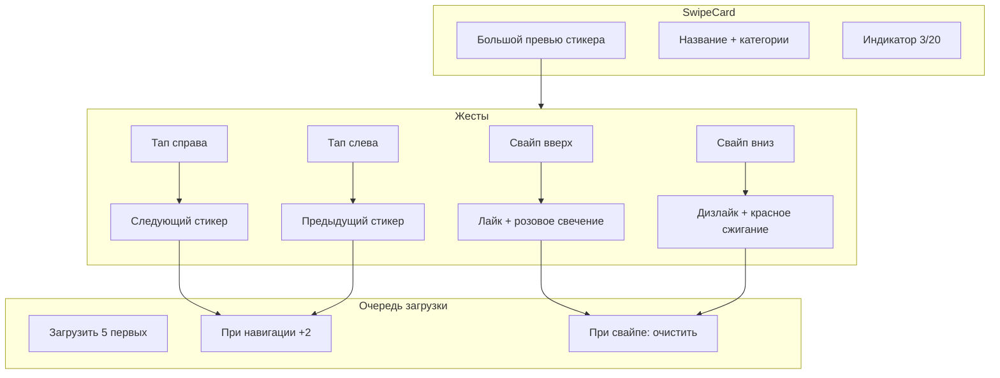

# Redesign SwipeCard: Вертикальный свайп + Большие превью

## Изменения в поведении

### 1. Вертикальный свайп карточки

- **Вверх** = Лайк (розовое свечение, как сейчас но по вертикали)
- **Вниз** = Дизлайк с эффектом "сжигания":
  - Красная подсветка фона (усиливается при свайпе)
  - Чёрная тень/рамка вокруг стикера
  - Визуально похоже на сжигание плохого стикера
- **Горизонтальный свайп** = Игнорируется (drag только по оси Y)

### 2. Навигация между стикерами

- **Тап по левому краю превью** (первые 30% ширины) = Предыдущий стикер
- **Тап по правому краю превью** (последние 30% ширины) = Следующий стикер
- **Тап по центру** = Следующий стикер (текущее поведение)
- Переключение только на **загруженные** стикеры (pending пропускаются)

### 3. Очередь загрузки стикеров

- При показе карточки: загрузить первые **5 стикеров**
- При навигации (тап по краям): догрузить ещё **2 из очереди**
- При свайпе (лайк/дизлайк): **очистить pending очередь** текущей карточки
- Использовать существующий `imageLoader` с приоритетами

## Файлы для изменения

### [miniapp/src/components/SwipeCard.tsx](miniapp/src/components/SwipeCard.tsx)

- Изменить `drag="x"` на `drag="y"`
- Обновить `rotate` transform для вертикального движения
- Новые эффекты свечения:
  - Вверх: розовый (`rgba(255, 105, 180, intensity)`)
  - Вниз: красный + чёрная тень (`rgba(255, 50, 50, intensity)` + `inset shadow`)
- Добавить логику тапа по краям для навигации
- Интегрировать `useStickerNavigation` для управления activeIndex
- Добавить индикатор позиции (точки или счётчик "3/20")

### [miniapp/src/hooks/useStickerLoadQueue.ts](miniapp/src/hooks/useStickerLoadQueue.ts) (новый файл)

Хук для управления очередью загрузки:

```typescript
interface UseStickerLoadQueueOptions {
  stickers: Sticker[];
  initialLoad: number;      // 5
  loadOnScroll: number;     // 2
  packId: string;
}

// Возвращает:
// - loadedIndices: Set<number>
// - isLoaded: (index: number) => boolean
// - triggerLoad: () => void  // вызывается при навигации
// - clearQueue: () => void   // вызывается при свайпе
```

### [miniapp/src/styles/DiscoverPage.css](miniapp/src/styles/DiscoverPage.css)

- Обновить эффекты свечения для вертикального свайпа
- Добавить стили для "burn effect" (красный градиент + чёрная внутренняя тень)
- Стили для индикатора позиции (точки/счётчик)
- Стили для зон тапа (левый/правый край)

## Визуальные эффекты

### Свайп вверх (Лайк)

```css
/* Розовое свечение */
box-shadow: 0 0 ${intensity * 40}px ${intensity * 15}px rgba(255, 105, 180, ${intensity});
```

### Свайп вниз (Дизлайк - "сжигание")

```css
/* Красный фон + чёрная внутренняя тень */
box-shadow: 
  0 0 ${intensity * 50}px ${intensity * 20}px rgba(255, 50, 50, ${intensity}),
  inset 0 0 ${intensity * 30}px rgba(0, 0, 0, ${intensity * 0.8});
background: linear-gradient(
  to bottom,
  transparent,
  rgba(255, 50, 50, ${intensity * 0.3})
);
```

## Диаграмма взаимодействия

