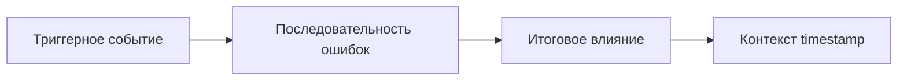

# План анализа логов Docker Build

## 📁 Информация о файле

**Файл:** `[docs/front.log](docs/front.log)`

**Характеристики:**

- Размер: 954 KB (954,551 байт)
- Формат: JSON массив
- Количество записей: **4,647**
- Временной диапазон: **2026-02-09 с 08:40:22 до 09:02:46** (~22 минуты)
- Тип: Логи Docker build watcher для фронтенд-приложения

**Структура записи:**

```json
{
  "content": "текст сообщения",
  "timestamp": "2026-02-09T08:40:22.542696866",
  "stream": "stderr" | "stdout"
}
```

## 🎯 Стратегия анализа

### ЭТАП 1: Предобработка и агрегация данных

Создам Python-скрипт `analyze_logs.py`, который выполнит:

#### 1.1 Базовая статистика

- Подтверждение количества записей и временного диапазона
- Распределение по потокам (stdout/stderr)
- Выявление самых длинных сообщений (возможные stacktrace)

#### 1.2 Категоризация по уровням логирования

- **ERROR/FATAL**: Критические ошибки
- **WARN**: Предупреждения
- **INFO**: Информационные сообщения
- **NPM**: Специфичные сообщения npm/yarn
- **DOCKER**: Сообщения Kaniko/Docker

#### 1.3 Поиск проблемных паттернов

Фильтрация записей по ключевым словам:

- `ERROR`, `FATAL`, `EXCEPTION`, `FAILED`, `FAIL`, `PANIC`
- `WARN`, `WARNING`, `DEPRECATED`
- `ENOENT`, `EACCES`, `ETIMEDOUT` (коды ошибок FS/сети)
- `npm ERR!`, `gyp ERR!` (ошибки сборки зависимостей)
- `killed`, `signal`, `segfault` (проблемы выполнения)

#### 1.4 Временной анализ

- Поиск аномально длинных пауз между событиями (>30 сек)
- Выявление "узких мест" в процессе сборки
- Построение timeline ключевых этапов:
  - Клонирование репозитория
  - Установка зависимостей (npm install)
  - Сборка проекта (npm run build)
  - Копирование артефактов

#### 1.5 Агрегация дубликатов

- Группировка идентичных ошибок по первым 100 символам
- Подсчет частоты повторений
- Выявление топ-10 самых частых проблем

### ЭТАП 2: Интеллектуальный анализ

На основе отфильтрованных данных с Этапа 1 выполню:

#### 2.1 Категоризация проблем

- **🔴 Критические (Critical)**: Приводят к падению сборки
- **🟠 Важные (High)**: Замедляют процесс или создают риски
- **🟡 Средние (Medium)**: Предупреждения, требующие внимания
- **🟢 Информационные (Low)**: Рекомендации по оптимизации

#### 2.2 Анализ корневых причин

Для каждой категории проблем прослежу цепочку событий:




Типичные сценарии для Docker build:

- Сетевые проблемы → таймауты → повторные попытки → замедление
- Отсутствие зависимостей → ошибки компиляции → фейл билда
- Проблемы кэша → пересборка → увеличение времени
- Ошибки permissions → падение шагов → прерывание

#### 2.3 Метрики производительности

- Общее время сборки: **22 минуты** (проверить, норма ли это)
- Самые долгие операции (топ-5 по временным интервалам)
- Соотношение времени: установка зависимостей vs сборка vs копирование

#### 2.4 Структурированные рекомендации

Для каждой проблемы предоставлю:

- **Описание**: Что произошло
- **Причина**: Почему произошло (гипотеза на основе логов)
- **Воздействие**: Как это влияет на процесс
- **Приоритет**: Critical/High/Medium/Low
- **Решение**: Конкретные шаги для исправления
- **Проверка**: Как убедиться, что проблема решена

## 📊 Формат финального отчета

```markdown
# Отчет по анализу логов Docker Build

## 📊 Сводка предобработки
- Базовая статистика
- Распределение по типам сообщений
- Временная шкала ключевых событий

## ⚠️ Ключевые проблемы
### 🔴 Критические (N найдено)
1. [Название проблемы]
   - Частота: X раз
   - Пример: [timestamp] сообщение
   - Категория: Сеть/База данных/Память/...

### 🟠 Важные (N найдено)
...

## 🔍 Анализ корневых причин
### Проблема 1: [Название]
- Триггер: событие в [timestamp]
- Последовательность: A → B → C
- Итог: воздействие на систему

## 📈 Метрики производительности
- График временных затрат по этапам
- Узкие места

## ✅ Рекомендации
### Приоритет 1 (Критический)
1. [Конкретное действие]
   - Причина: ...
   - Ожидаемый результат: ...
   
### Приоритет 2 (Высокий)
...
```

## 🛠️ Технические детали реализации

**Скрипт Python** будет использовать:

- `json` для парсинга логов
- `collections.Counter` для агрегации
- `datetime` для временного анализа
- Регулярные выражения для извлечения паттернов (npm versions, error codes)

**Вывод** будет сохранен в:

- `docs/log_analysis_report.md` - финальный Markdown отчет
- `docs/filtered_logs.json` - отфильтрованные данные для дополнительного анализа (опционально)

